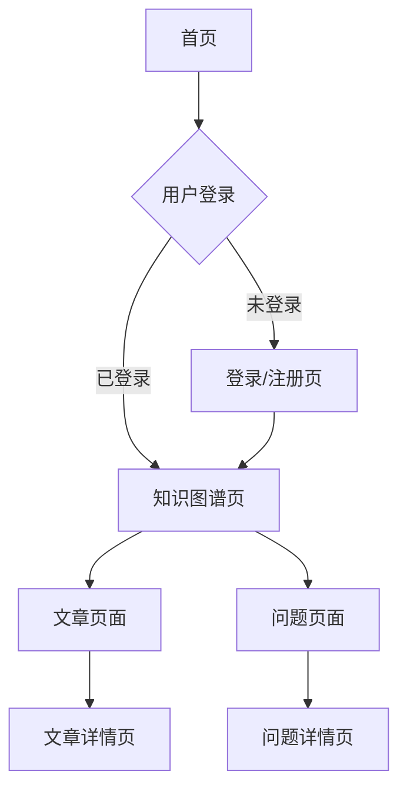

## 1. 产品概述
这是一个个性化知识图谱网站，用户可以注册账户并构建自己的知识体系。每个用户的知识以网状结构组织，包含多张图谱、文章和问题解决方案。用户可以通过可视化界面管理和展示自己的知识结构。

目标用户：需要整理和管理个人知识体系的学生、研究者、知识工作者。

## 2. 核心功能

### 2.1 用户角色
| 角色 | 注册方式 | 核心权限 |
|------|----------|----------|
| 普通用户 | 手机注册/邮箱注册 | 创建和管理个人知识图谱、文章、问题 |
| 访客 | 无需注册 | 浏览网站介绍 |

创建项目时先新建一个角色admin做测试

### 2.2 功能模块
网站包含以下主要页面：
1. **首页**：网站介绍、登录入口、注册用户引导
2. **知识图谱页**：可视化展示知识图谱、搜索功能、图谱编辑
3. **文章页面**：文章列表、文章详情、Markdown编辑
4. **问题页面**：问题列表、问题详情、动画脚本编辑

### 2.3 页面详情
| 页面名称 | 模块名称 | 功能描述 |
|----------|----------|----------|
| 首页 | 网站介绍 | 展示网站功能和价值主张，包含登录/注册按钮 |
| 首页 | 用户入口 | 登录后显示"进入我的世界"按钮，跳转到个人知识图谱页 |
| 知识图谱页 | 图谱展示 | 使用React-Flow展示图谱，优先显示root.json，否则显示默认图谱 |
| 知识图谱页 | 搜索功能 | 点击放大镜图标弹出搜索框，支持按文件名和别名搜索图谱 |
| 知识图谱页 | 图谱编辑 | 右下角编辑按钮，进入JSON编辑模式，支持保存修改 |
| 知识图谱页 | 新建图谱 | 搜索结果底部显示添加按钮，创建新图谱文件 |
| 文章页面 | 文章列表 | 按最近保存时间排序显示所有文章 |
| 文章页面 | 文章详情 | 点击标题进入详情页，展示Markdown内容 |
| 文章页面 | 内容编辑 | 右下角编辑按钮，支持Markdown文件编辑和保存 |
| 问题页面 | 问题列表 | 按最近保存时间排序显示所有问题 |
| 问题页面 | 问题详情 | 分为内容展示和动画脚本两个部分 |
| 问题页面 | 内容编辑 | 支持Markdown内容编辑和保存 |
| 问题页面 | 动画脚本 | 支持动画脚本编辑和播放功能 |

## 3. 核心流程

### 用户注册登录流程
1. 访问首页 → 点击登录按钮 → 注册/登录账户 → 进入个人知识图谱页

### 知识管理流程
1. 知识图谱：浏览图谱 → 搜索/编辑/创建图谱 → 保存修改
2. 文章管理：查看文章列表 → 阅读/编辑文章 → 保存修改
3. 问题管理：查看问题列表 → 编辑问题内容和动画脚本 → 播放动画演示

## 4. 用户界面设计

### 4.1 设计风格
- **主色调**：极致简约，以白色(#FFFFFF)或浅灰(#F5F5F7)为背景，黑色(#1D1D1F)为主文字色，苹果蓝(#007AFF)作为点缀和交互色
- **按钮样式**：胶囊型或大圆角设计，扁平化为主，配合细腻的阴影和毛玻璃效果，交互反馈灵敏
- **字体**：优先使用 San Francisco 或系统默认无衬线字体，强调排版层级和呼吸感，阅读体验极佳
- **布局风格**：通透大气，大量留白，导航栏和弹窗采用磨砂玻璃(Blur)质感，卡片轻微圆角无边框
- **图标风格**：采用 SF Symbols 风格的精致线性图标，线条纤细流畅，与文字排版高度统一

### 4.2 页面设计概述
| 页面名称 | 模块名称 | UI元素 |
|----------|----------|----------|
| 首页 | 网站介绍 | 居中布局，大标题+副标题，蓝色渐变背景，白色卡片展示特色功能 |
| 首页 | 登录区域 | 右上角圆角按钮，悬停效果，模态框形式的登录/注册表单 |
| 知识图谱页 | 图谱容器 | 全屏画布，深色背景，彩色节点，支持拖拽和缩放 |
| 知识图谱页 | 搜索框 | 顶部居中，圆角输入框，实时搜索建议，结果下拉列表 |
| 文章页面 | 文章列表 | 卡片式布局，显示标题和最后修改时间，悬停阴影效果 |
| 文章详情页 | 内容区域 | 白色背景，Markdown渲染样式，固定底部编辑按钮 |
| 问题页面 | 双栏布局 | 左侧内容区域，右侧动画脚本区域，标签页切换 |

### 4.3 响应式设计
- **桌面优先**：默认针对桌面端优化，最小宽度1200px
- **移动端适配**：支持平板和手机端访问，采用响应式布局
- **触摸优化**：移动端支持手势操作，如图谱缩放和节点拖拽