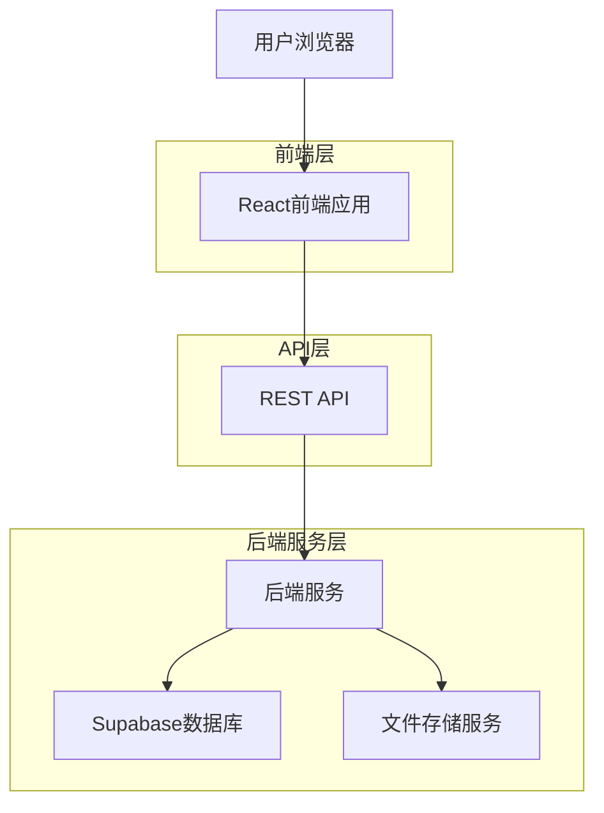
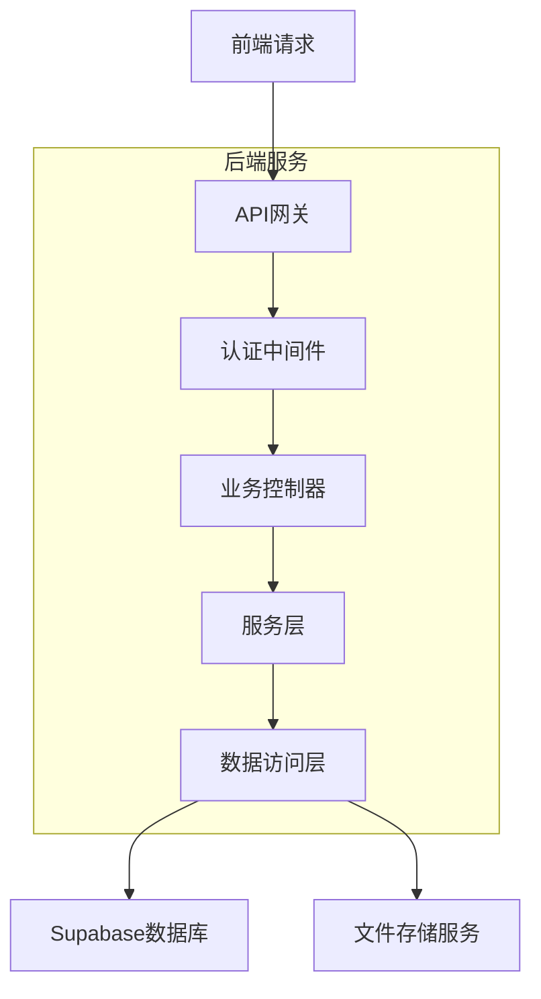
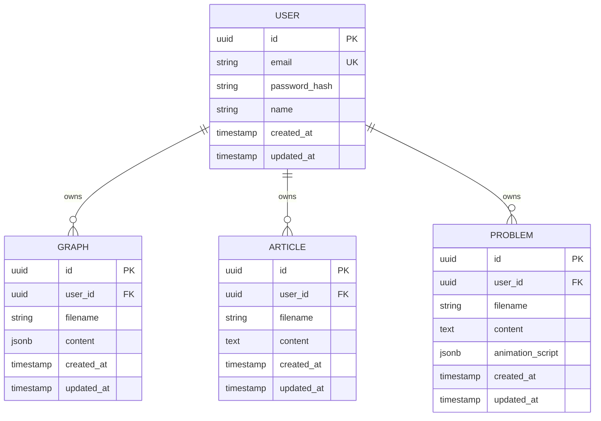

## 1. 架构设计



## 2. 技术栈描述

* **前端**: React\@18 + React-Flow\@11 + TailwindCSS\@3 + Vite

* **初始化工具**: vite-init

* **状态管理**: React Context + useReducer

* **路由**: React Router\@6

* **Markdown渲染**: react-markdown + remark-gfm

* **后端**: Node.js + Express\@4 (由同事负责)

* **数据库**: Supabase (PostgreSQL)

* **文件存储**: Supabase Storage

## 3. 路由定义

| 路由                 | 用途              |
| ------------------ | --------------- |
| /                  | 首页，网站介绍和登录入口    |
| /login             | 登录页面，用户身份验证     |
| /register          | 注册页面，新用户注册      |
| /dashboard         | 个人仪表板，导航到各个功能模块 |
| /graphs            | 知识图谱列表页面        |
| /graphs/:id        | 特定图谱展示页面        |
| /graphs/:id/edit   | 图谱编辑页面          |
| /graphs/new        | 新建图谱页面          |
| /articles          | 文章列表页面          |
| /articles/:id      | 文章详情页面          |
| /articles/:id/edit | 文章编辑页面          |
| /articles/new      | 新建文章页面          |
| /problems          | 问题列表页面          |
| /problems/:id      | 问题详情页面          |
| /problems/:id/edit | 问题编辑页面          |
| /problems/new      | 新建问题页面          |

## 4. API定义

### 4.1 用户认证相关

#### 用户注册

```
POST /api/auth/register
```

请求参数：

| 参数名      | 类型     | 必需 | 描述         |
| -------- | ------ | -- | ---------- |
| email    | string | 是  | 用户邮箱地址     |
| password | string | 是  | 用户密码（至少6位） |
| name     | string | 是  | 用户昵称       |

响应：

```json
{
  "success": true,
  "data": {
    "userId": "uuid",
    "email": "user@example.com",
    "name": "用户名"
  },
  "token": "jwt_token_string"
}
```

#### 用户登录

```
POST /api/auth/login
```

请求参数：

| 参数名      | 类型     | 必需 | 描述     |
| -------- | ------ | -- | ------ |
| email    | string | 是  | 用户邮箱地址 |
| password | string | 是  | 用户密码   |

响应：

```json
{
  "success": true,
  "data": {
    "userId": "uuid",
    "email": "user@example.com",
    "name": "用户名"
  },
  "token": "jwt_token_string"
}
```

### 4.2 知识图谱管理

#### 获取用户所有图谱

```
GET /api/graphs
```

请求头：

```
Authorization: Bearer {jwt_token}
```

响应：

```json
{
  "success": true,
  "data": [
    {
      "id": "graph_uuid",
      "filename": "root.json",
      "title": "根图谱",
      "tags": ["基础", "核心"],
      "aliases": ["root", "main"],
      "cssclasses": "graph-style",
      "updatedAt": "2024-01-01T00:00:00Z"
    }
  ]
}
```

#### 获取特定图谱内容

```
GET /api/graphs/:id
```

响应：

```json
{
  "success": true,
  "data": {
    "id": "graph_uuid",
    "filename": "root.json",
    "content": {
      "tags": ["基础", "核心"],
      "aliases": ["root", "main"],
      "cssclasses": "graph-style",
      "nodes": [
        {
          "id": "node1",
          "label": "知识点1",
          "color": "#ff0000",
          "x": 100,
          "y": 200,
          "link": "internal:/articles/article1"
        }
      ],
      "edges": [
        {
          "source": "node1",
          "target": "node2",
          "label": "相关"
        }
      ]
    }
  }
}
```

#### 创建新图谱

```
POST /api/graphs
```

请求体：

```json
{
  "filename": "new_graph.json",
  "content": {
    "tags": [],
    "aliases": [],
    "cssclasses": "default",
    "nodes": [],
    "edges": []
  }
}
```

#### 更新图谱

```
PUT /api/graphs/:id
```

请求体：

```json
{
  "content": {
    "tags": ["更新"],
    "aliases": ["updated"],
    "cssclasses": "graph-style",
    "nodes": [...],
    "edges": [...]
  }
}
```

### 4.3 文章管理

#### 获取用户所有文章

```
GET /api/articles
```

响应：

```json
{
  "success": true,
  "data": [
    {
      "id": "article_uuid",
      "filename": "article1.md",
      "title": "文章标题",
      "updatedAt": "2024-01-01T00:00:00Z"
    }
  ]
}
```

#### 获取文章内容

```
GET /api/articles/:id
```

响应：

```json
{
  "success": true,
  "data": {
    "id": "article_uuid",
    "filename": "article1.md",
    "content": "# 文章标题\n\n文章内容...",
    "updatedAt": "2024-01-01T00:00:00Z"
  }
}
```

#### 创建/更新文章

```
POST /api/articles
PUT /api/articles/:id
```

请求体：

```json
{
  "filename": "article1.md",
  "content": "# 文章标题\n\n文章内容..."
}
```

### 4.4 问题管理

#### 获取用户所有问题

```
GET /api/problems
```

响应：

```json
{
  "success": true,
  "data": [
    {
      "id": "problem_uuid",
      "filename": "problem1",
      "title": "问题标题",
      "updatedAt": "2024-01-01T00:00:00Z"
    }
  ]
}
```

#### 获取问题详情

```
GET /api/problems/:id
```

响应：

```json
{
  "success": true,
  "data": {
    "id": "problem_uuid",
    "filename": "problem1",
    "content": "# 问题描述\n\n问题内容...",
    "animationScript": {
      "steps": [
        {
          "type": "navigate",
          "target": "graph:root.json",
          "duration": 1000
        },
        {
          "type": "highlightNode",
          "nodeId": "node1",
          "duration": 2000
        }
      ]
    },
    "updatedAt": "2024-01-01T00:00:00Z"
  }
}
```

#### 创建/更新问题

```
POST /api/problems
PUT /api/problems/:id
```

请求体：

```json
{
  "filename": "problem1",
  "content": "# 问题描述\n\n问题内容...",
  "animationScript": {
    "steps": [...]
  }
}
```

### 4.5 搜索功能

#### 搜索图谱

```
GET /api/search/graphs?q={keyword}
```

响应：

```json
{
  "success": true,
  "data": [
    {
      "id": "graph_uuid",
      "filename": "matching_file.json",
      "title": "匹配标题",
      "matchedFields": ["filename", "aliases"]
    }
  ]
}
```

## 5. 服务器架构



## 6. 数据模型

### 6.1 用户数据结构设计



### 6.2 数据库表结构

#### 用户表 (users)

```sql
CREATE TABLE users (
    id UUID PRIMARY KEY DEFAULT gen_random_uuid(),
    email VARCHAR(255) UNIQUE NOT NULL,
    password_hash VARCHAR(255) NOT NULL,
    name VARCHAR(100) NOT NULL,
    created_at TIMESTAMP WITH TIME ZONE DEFAULT NOW(),
    updated_at TIMESTAMP WITH TIME ZONE DEFAULT NOW()
);

CREATE INDEX idx_users_email ON users(email);
```

#### 图谱表 (graphs)

```sql
CREATE TABLE graphs (
    id UUID PRIMARY KEY DEFAULT gen_random_uuid(),
    user_id UUID NOT NULL REFERENCES users(id) ON DELETE CASCADE,
    filename VARCHAR(255) NOT NULL,
    content JSONB NOT NULL DEFAULT '{}',
    created_at TIMESTAMP WITH TIME ZONE DEFAULT NOW(),
    updated_at TIMESTAMP WITH TIME ZONE DEFAULT NOW(),
    UNIQUE(user_id, filename)
);

CREATE INDEX idx_graphs_user_id ON graphs(user_id);
CREATE INDEX idx_graphs_updated_at ON graphs(updated_at DESC);
```

#### 文章表 (articles)

```sql
CREATE TABLE articles (
    id UUID PRIMARY KEY DEFAULT gen_random_uuid(),
    user_id UUID NOT NULL REFERENCES users(id) ON DELETE CASCADE,
    filename VARCHAR(255) NOT NULL,
    content TEXT NOT NULL DEFAULT '',
    created_at TIMESTAMP WITH TIME ZONE DEFAULT NOW(),
    updated_at TIMESTAMP WITH TIME ZONE DEFAULT NOW(),
    UNIQUE(user_id, filename)
);

CREATE INDEX idx_articles_user_id ON articles(user_id);
CREATE INDEX idx_articles_updated_at ON articles(updated_at DESC);
```

#### 问题表 (problems)

```sql
CREATE TABLE problems (
    id UUID PRIMARY KEY DEFAULT gen_random_uuid(),
    user_id UUID NOT NULL REFERENCES users(id) ON DELETE CASCADE,
    filename VARCHAR(255) NOT NULL,
    content TEXT NOT NULL DEFAULT '',
    animation_script JSONB NOT NULL DEFAULT '{}',
    created_at TIMESTAMP WITH TIME ZONE DEFAULT NOW(),
    updated_at TIMESTAMP WITH TIME ZONE DEFAULT NOW(),
    UNIQUE(user_id, filename)
);

CREATE INDEX idx_problems_user_id ON problems(user_id);
CREATE INDEX idx_problems_updated_at ON problems(updated_at DESC);
```

### 6.3 Supabase权限配置

```sql
-- 基本访问权限
GRANT SELECT ON users TO anon;
GRANT SELECT ON graphs TO anon;
GRANT SELECT ON articles TO anon;
GRANT SELECT ON problems TO anon;

-- 认证用户完整权限
GRANT ALL PRIVILEGES ON users TO authenticated;
GRANT ALL PRIVILEGES ON graphs TO authenticated;
GRANT ALL PRIVILEGES ON articles TO authenticated;
GRANT ALL PRIVILEGES ON problems TO authenticated;

-- RLS策略（行级安全）
ALTER TABLE graphs ENABLE ROW LEVEL SECURITY;
ALTER TABLE articles ENABLE ROW LEVEL SECURITY;
ALTER TABLE problems ENABLE ROW LEVEL SECURITY;

-- 用户只能访问自己的数据
CREATE POLICY "用户只能查看自己的图谱" ON graphs
    FOR ALL USING (auth.uid() = user_id);

CREATE POLICY "用户只能查看自己的文章" ON articles
    FOR ALL USING (auth.uid() = user_id);

CREATE POLICY "用户只能查看自己的问题" ON problems
    FOR ALL USING (auth.uid() = user_id);
```

